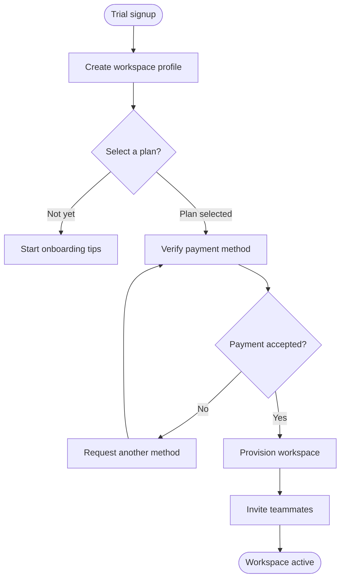
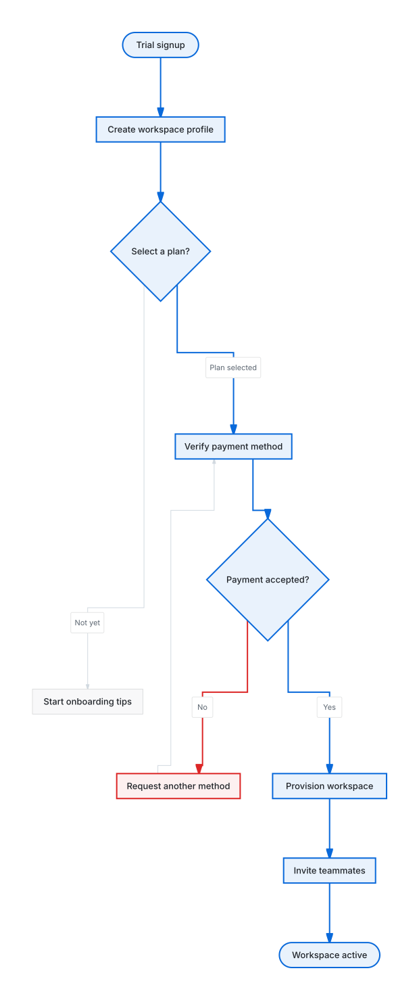

# Subscription intake

Practice emphasizing a primary path while keeping payment recovery readable.

**Capability:** full flowchart/state pipeline.



## Rendered output



Generated with:

```bash
beautiflow render examples/sources/01-subscription-intake.mmd --format svg --theme github-light --output examples/rendered/01-subscription-intake.svg
```

## Try it

Keep the live result open:

```bash
beautiflow server examples/sources/01-subscription-intake.mmd
```

Run Beautiflow directly:

```bash
beautiflow polish examples/sources/01-subscription-intake.mmd
```

Or ask an agent with the Beautiflow skill:

```text
Make the activation path primary and style payment retries as an exception without changing the topology.
Use examples/sources/01-subscription-intake.mmd and show me the result.
```
