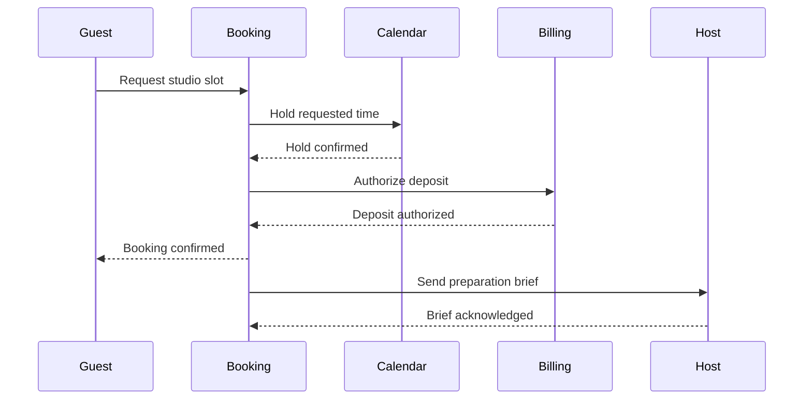
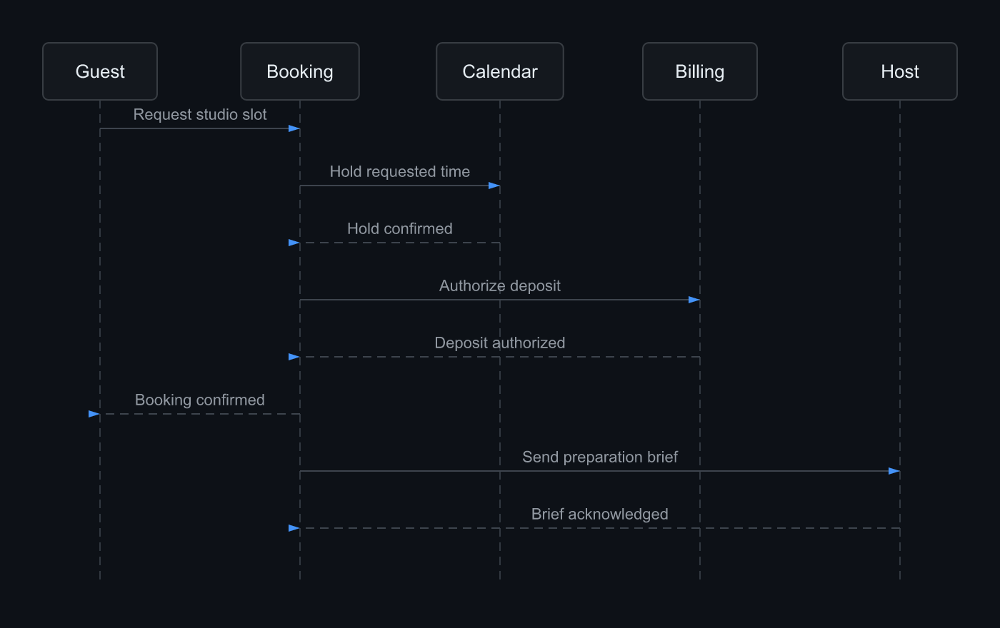

# Studio booking sequence

Exercise a five-party booking exchange with authorization and host notification.

**Capability:** render-only specialized family.



## Rendered output



Generated with:

```bash
beautiflow render examples/sources/02-studio-booking-sequence.mmd --format png --theme github-dark --output examples/rendered/02-studio-booking-sequence.png
```

## Try it

Keep the live result open:

```bash
beautiflow server examples/sources/02-studio-booking-sequence.mmd
```

Run Beautiflow directly:

```bash
beautiflow render examples/sources/02-studio-booking-sequence.mmd --format svg
```

Or ask an agent with the Beautiflow skill:

```text
Review the booking exchange for readability and render a polished preview.
Use examples/sources/02-studio-booking-sequence.mmd and show me the result.
```
