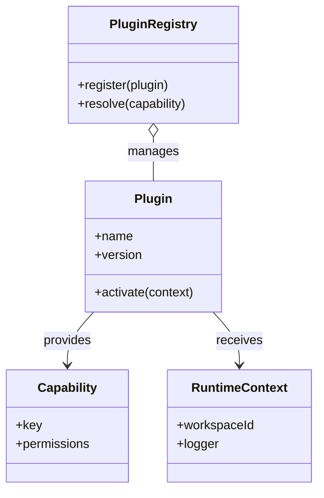
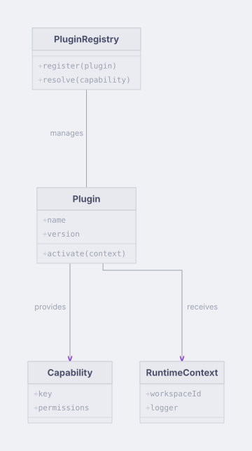

# Plugin class model

Explore a compact class model with composition and dependency relationships.

**Capability:** render-only specialized family.



## Rendered output



Generated with:

```bash
beautiflow render examples/sources/03-plugin-class-model.mmd --format svg --theme catppuccin-latte --output examples/rendered/03-plugin-class-model.svg
```

## Try it

Keep the live result open:

```bash
beautiflow server examples/sources/03-plugin-class-model.mmd
```

Run Beautiflow directly:

```bash
beautiflow render examples/sources/03-plugin-class-model.mmd --format svg
```

Or ask an agent with the Beautiflow skill:

```text
Render the plugin model and explain whether the relationships communicate ownership clearly.
Use examples/sources/03-plugin-class-model.mmd and show me the result.
```
