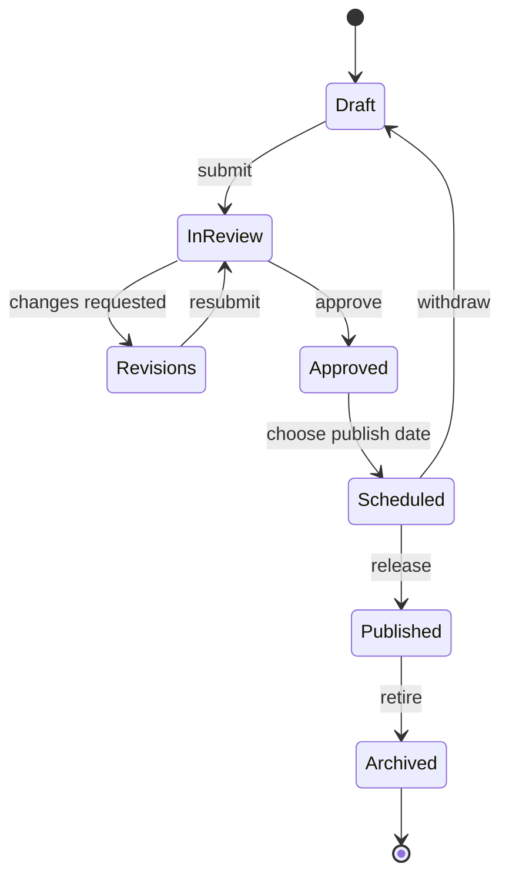
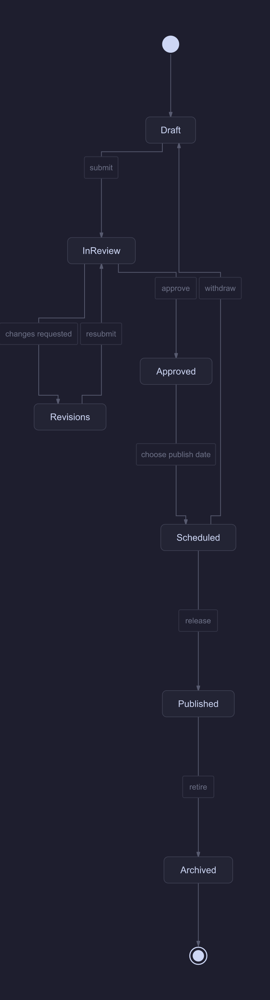

# Editorial review lifecycle

Work with a reversible state machine from drafting through archival.

**Capability:** full flowchart/state pipeline.



## Rendered output



Generated with:

```bash
beautiflow render examples/sources/04-editorial-review-lifecycle.mmd --format png --theme catppuccin-mocha --output examples/rendered/04-editorial-review-lifecycle.png
```

## Try it

Keep the live result open:

```bash
beautiflow server examples/sources/04-editorial-review-lifecycle.mmd
```

Run Beautiflow directly:

```bash
beautiflow polish examples/sources/04-editorial-review-lifecycle.mmd
```

Or ask an agent with the Beautiflow skill:

```text
Polish the lifecycle while keeping review revisions and withdrawal paths visually secondary.
Use examples/sources/04-editorial-review-lifecycle.mmd and show me the result.
```
