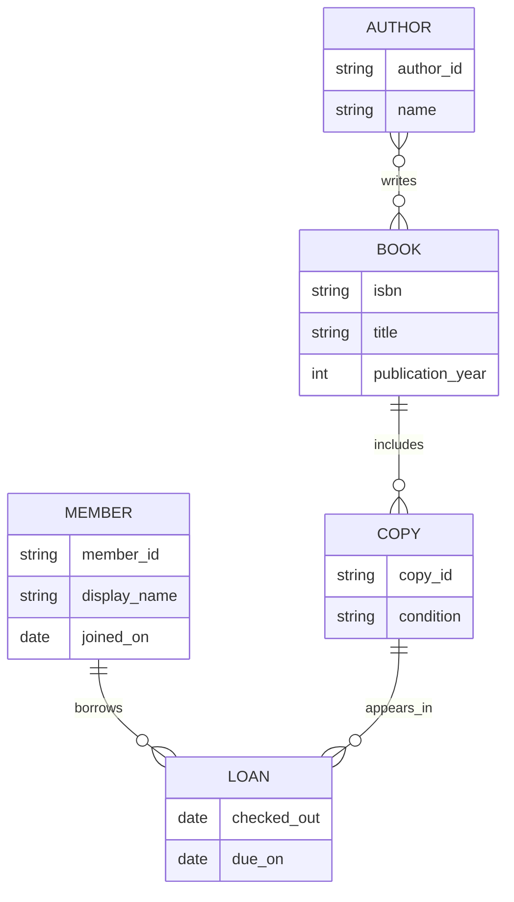
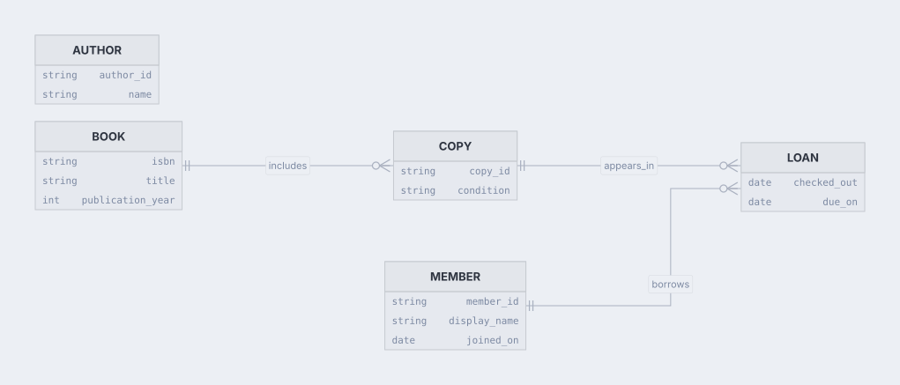

# Community library ERD

Render a small lending domain with one-to-many and many-to-many relationships.

**Capability:** render-only specialized family.



## Rendered output



Generated with:

```bash
beautiflow render examples/sources/05-community-library-erd.mmd --format svg --theme nord-light --output examples/rendered/05-community-library-erd.svg
```

## Try it

Keep the live result open:

```bash
beautiflow server examples/sources/05-community-library-erd.mmd
```

Run Beautiflow directly:

```bash
beautiflow render examples/sources/05-community-library-erd.mmd --format svg
```

Or ask an agent with the Beautiflow skill:

```text
Render the library model and check whether the entities and cardinalities are easy to scan.
Use examples/sources/05-community-library-erd.mmd and show me the result.
```
