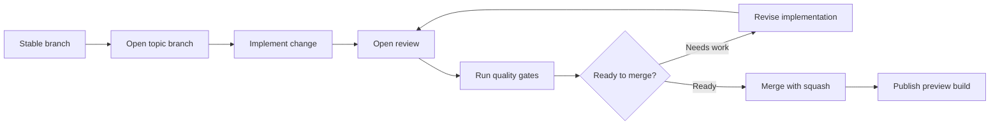
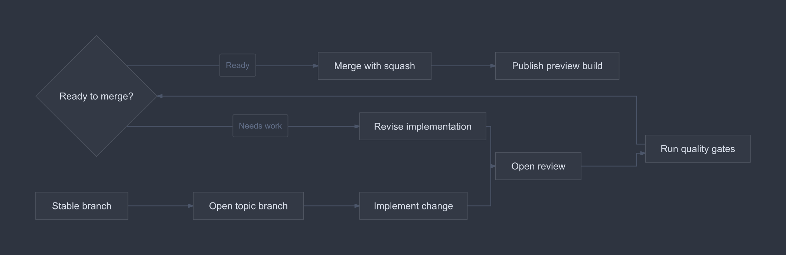

# Release branch flow

Practice a horizontal workflow with a review loop and preview release.

**Capability:** full flowchart/state pipeline.



## Rendered output



Generated with:

```bash
beautiflow render examples/sources/06-release-branch-flow.mmd --format png --theme nord --output examples/rendered/06-release-branch-flow.png
```

## Try it

Keep the live result open:

```bash
beautiflow server examples/sources/06-release-branch-flow.mmd
```

Run Beautiflow directly:

```bash
beautiflow polish examples/sources/06-release-branch-flow.mmd
```

Or ask an agent with the Beautiflow skill:

```text
Make the successful merge path primary and the revision loop secondary.
Use examples/sources/06-release-branch-flow.mmd and show me the result.
```
