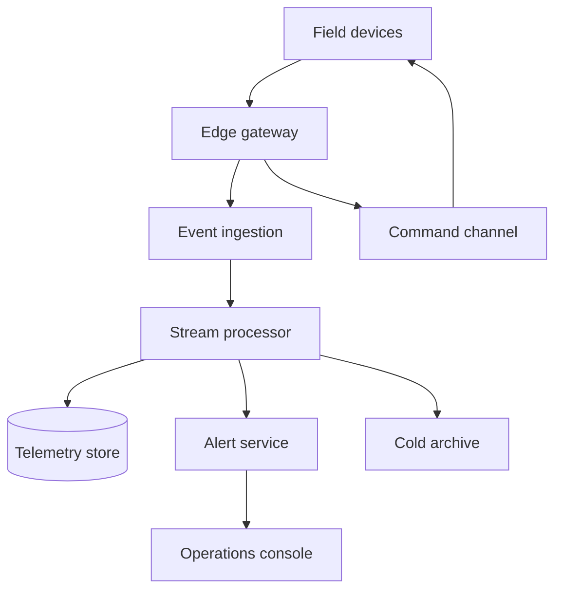
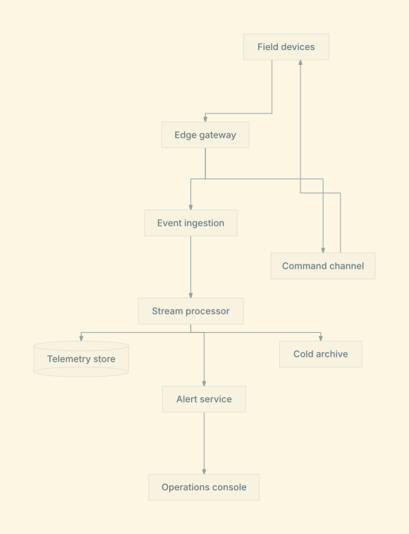

# Edge platform architecture

Explore telemetry ingestion, command delivery, alerting, and storage.

**Capability:** full flowchart/state pipeline.



## Rendered output



Generated with:

```bash
beautiflow render examples/sources/07-edge-platform-architecture.mmd --format svg --theme solarized-light --output examples/rendered/07-edge-platform-architecture.svg
```

## Try it

Keep the live result open:

```bash
beautiflow server examples/sources/07-edge-platform-architecture.mmd
```

Run Beautiflow directly:

```bash
beautiflow polish examples/sources/07-edge-platform-architecture.mmd
```

Or ask an agent with the Beautiflow skill:

```text
Polish the platform diagram and keep the command feedback loop visually distinct from telemetry flow.
Use examples/sources/07-edge-platform-architecture.mmd and show me the result.
```
