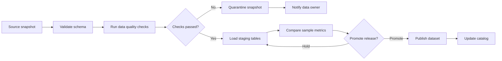
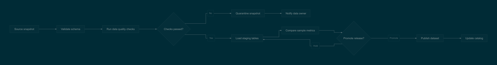

# Data release pipeline

Work with two gates, quarantine handling, and a promotion loop.

**Capability:** full flowchart/state pipeline.



## Rendered output



Generated with:

```bash
beautiflow render examples/sources/08-data-release-pipeline.mmd --format png --theme solarized-dark --output examples/rendered/08-data-release-pipeline.png
```

## Try it

Keep the live result open:

```bash
beautiflow server examples/sources/08-data-release-pipeline.mmd
```

Run Beautiflow directly:

```bash
beautiflow polish examples/sources/08-data-release-pipeline.mmd
```

Or ask an agent with the Beautiflow skill:

```text
Emphasize the publish path, then make quarantine and hold behavior clearly exceptional.
Use examples/sources/08-data-release-pipeline.mmd and show me the result.
```
