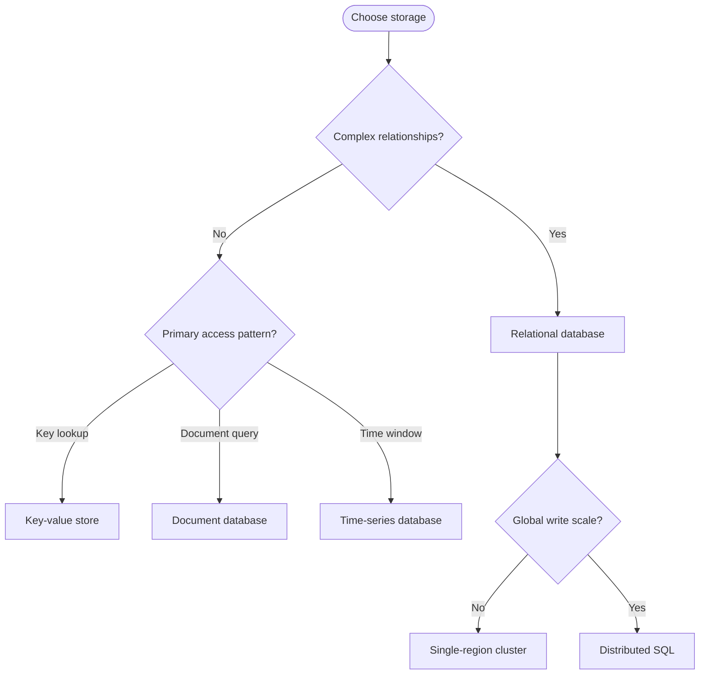
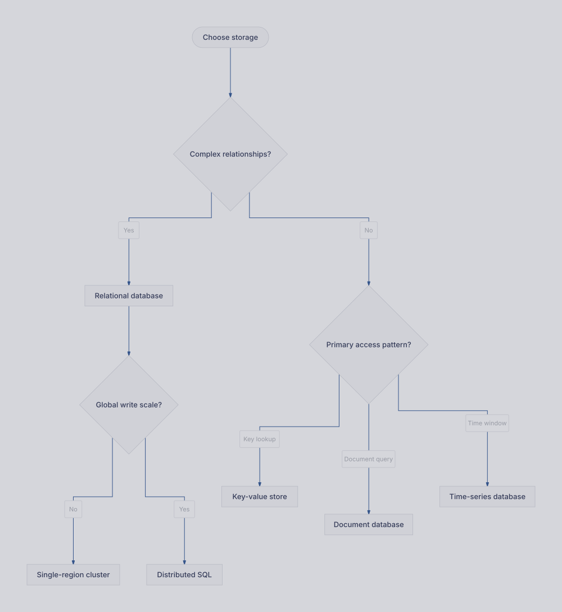

# Storage selection guide

Practice arranging a branching technology decision tree.

**Capability:** full flowchart/state pipeline.



## Rendered output



Generated with:

```bash
beautiflow render examples/sources/09-storage-selection.mmd --format svg --theme tokyo-night-light --output examples/rendered/09-storage-selection.svg
```

## Try it

Keep the live result open:

```bash
beautiflow server examples/sources/09-storage-selection.mmd
```

Run Beautiflow directly:

```bash
beautiflow polish examples/sources/09-storage-selection.mmd
```

Or ask an agent with the Beautiflow skill:

```text
Polish the decision tree and keep branch labels aligned and easy to compare.
Use examples/sources/09-storage-selection.mmd and show me the result.
```
