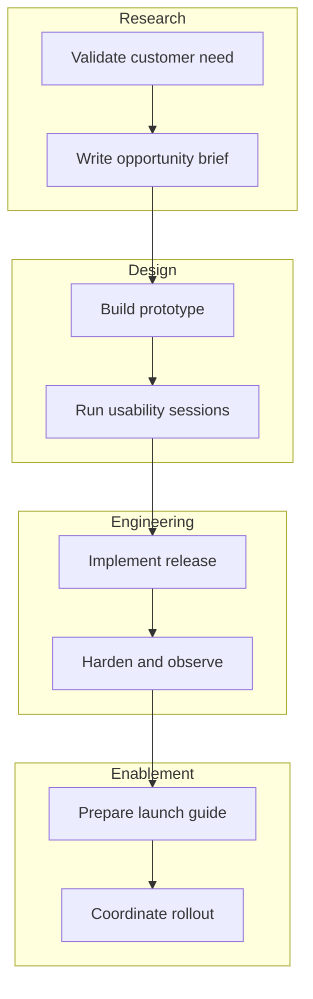
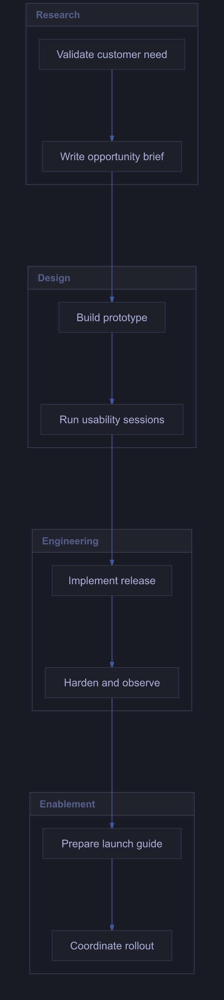

# Product launch handoffs

Explore a cross-functional sequence organized into four subgraphs.

**Capability:** full flowchart/state pipeline.



## Rendered output



Generated with:

```bash
beautiflow render examples/sources/10-product-launch-handoffs.mmd --format png --theme tokyo-night --output examples/rendered/10-product-launch-handoffs.png
```

## Try it

Keep the live result open:

```bash
beautiflow server examples/sources/10-product-launch-handoffs.mmd
```

Run Beautiflow directly:

```bash
beautiflow polish examples/sources/10-product-launch-handoffs.mmd
```

Or ask an agent with the Beautiflow skill:

```text
Polish the handoff flow while preserving every team grouping.
Use examples/sources/10-product-launch-handoffs.mmd and show me the result.
```
