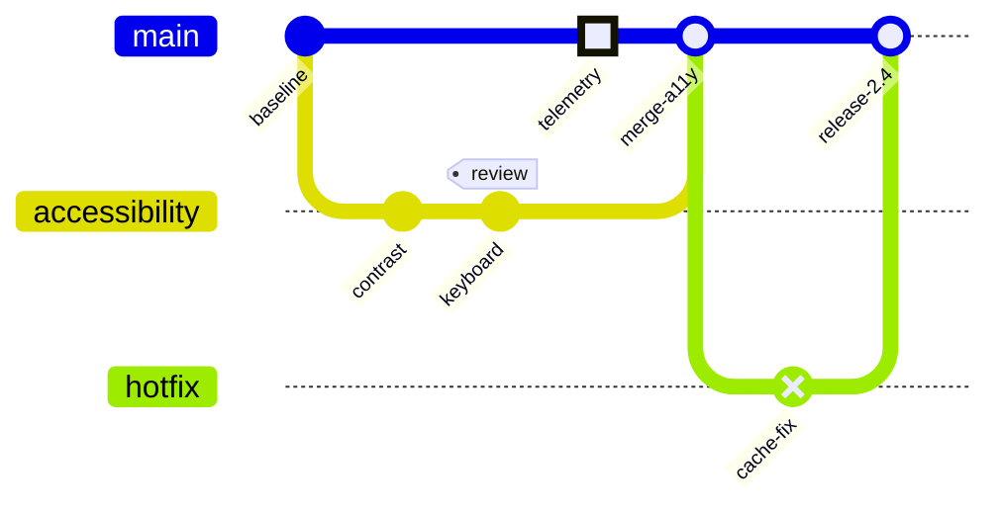
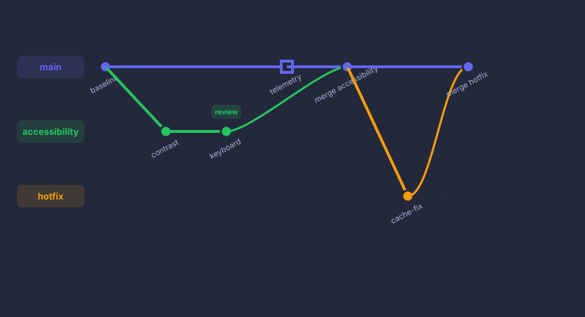

# Release train history

Render branches, merges, tags, highlighted work, and a hotfix.

**Capability:** render-only specialized family.



## Rendered output



Generated with:

```bash
beautiflow render examples/sources/11-release-train-history.mmd --format svg --theme tokyo-night-storm --output examples/rendered/11-release-train-history.svg
```

## Try it

Keep the live result open:

```bash
beautiflow server examples/sources/11-release-train-history.mmd
```

Run Beautiflow directly:

```bash
beautiflow render examples/sources/11-release-train-history.mmd --format svg
```

Or ask an agent with the Beautiflow skill:

```text
Render the release history and summarize its branch story in one sentence.
Use examples/sources/11-release-train-history.mmd and show me the result.
```
