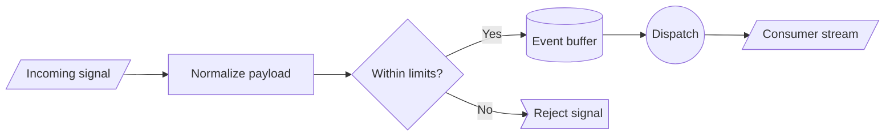
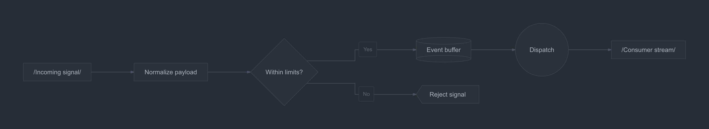

# Shape language

Compare input, process, decision, datastore, odd, and circular nodes.

**Capability:** full flowchart/state pipeline.



## Rendered output



Generated with:

```bash
beautiflow render examples/sources/12-shape-language.mmd --format png --theme one-dark --output examples/rendered/12-shape-language.png
```

## Try it

Keep the live result open:

```bash
beautiflow server examples/sources/12-shape-language.mmd
```

Run Beautiflow directly:

```bash
beautiflow polish examples/sources/12-shape-language.mmd
```

Or ask an agent with the Beautiflow skill:

```text
Polish the flow without replacing the intentionally varied node shapes.
Use examples/sources/12-shape-language.mmd and show me the result.
```
