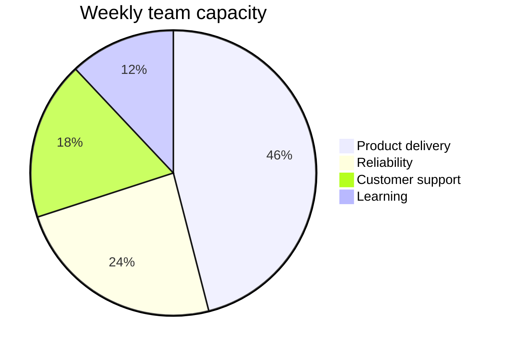
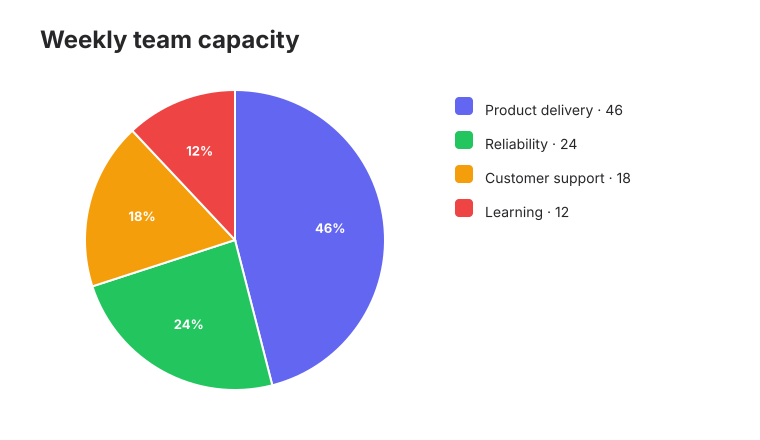

# Team capacity

Render a four-segment capacity allocation pie chart.

**Capability:** render-only specialized family.



## Rendered output



Generated with:

```bash
beautiflow render examples/sources/13-team-capacity.mmd --format svg --theme zinc-light --output examples/rendered/13-team-capacity.svg
```

## Try it

Keep the live result open:

```bash
beautiflow server examples/sources/13-team-capacity.mmd
```

Run Beautiflow directly:

```bash
beautiflow render examples/sources/13-team-capacity.mmd --format svg
```

Or ask an agent with the Beautiflow skill:

```text
Render the capacity chart and verify that every label remains legible.
Use examples/sources/13-team-capacity.mmd and show me the result.
```
