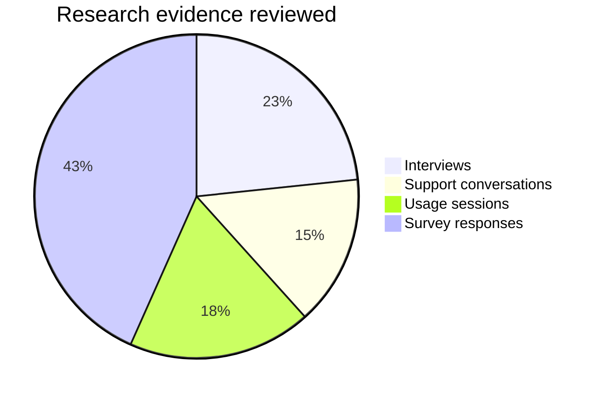
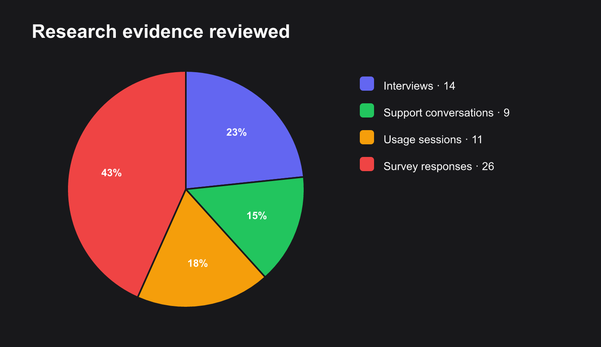

# Research synthesis

Render an evidence mix with four differently sized sources.

**Capability:** render-only specialized family.



## Rendered output



Generated with:

```bash
beautiflow render examples/sources/14-research-synthesis.mmd --format png --theme zinc-dark --output examples/rendered/14-research-synthesis.png
```

## Try it

Keep the live result open:

```bash
beautiflow server examples/sources/14-research-synthesis.mmd
```

Run Beautiflow directly:

```bash
beautiflow render examples/sources/14-research-synthesis.mmd --format svg
```

Or ask an agent with the Beautiflow skill:

```text
Render the evidence chart and describe the dominant source.
Use examples/sources/14-research-synthesis.mmd and show me the result.
```
