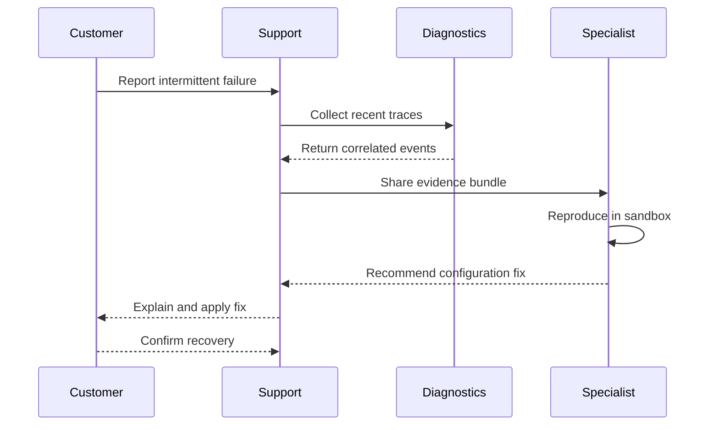
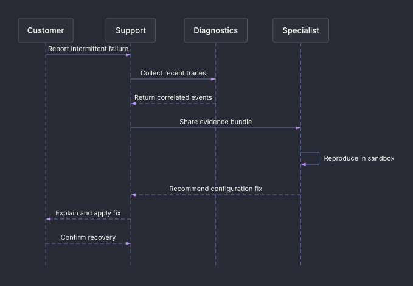

# Support escalation sequence

Trace evidence collection and a specialist handoff through recovery.

**Capability:** render-only specialized family.

Message labels use the theme foreground for legibility; lifelines, connectors, and arrowheads retain the Dracula palette.



## Rendered output



Generated with:

```bash
beautiflow render examples/sources/15-support-escalation-sequence.mmd --format svg --theme dracula --output examples/rendered/15-support-escalation-sequence.svg
```

## Try it

Keep the live result open:

```bash
beautiflow server examples/sources/15-support-escalation-sequence.mmd
```

Run Beautiflow directly:

```bash
beautiflow render examples/sources/15-support-escalation-sequence.mmd --format svg
```

Or ask an agent with the Beautiflow skill:

```text
Render the support exchange and check whether request and response direction is immediately clear.
Use examples/sources/15-support-escalation-sequence.mmd and show me the result.
```
