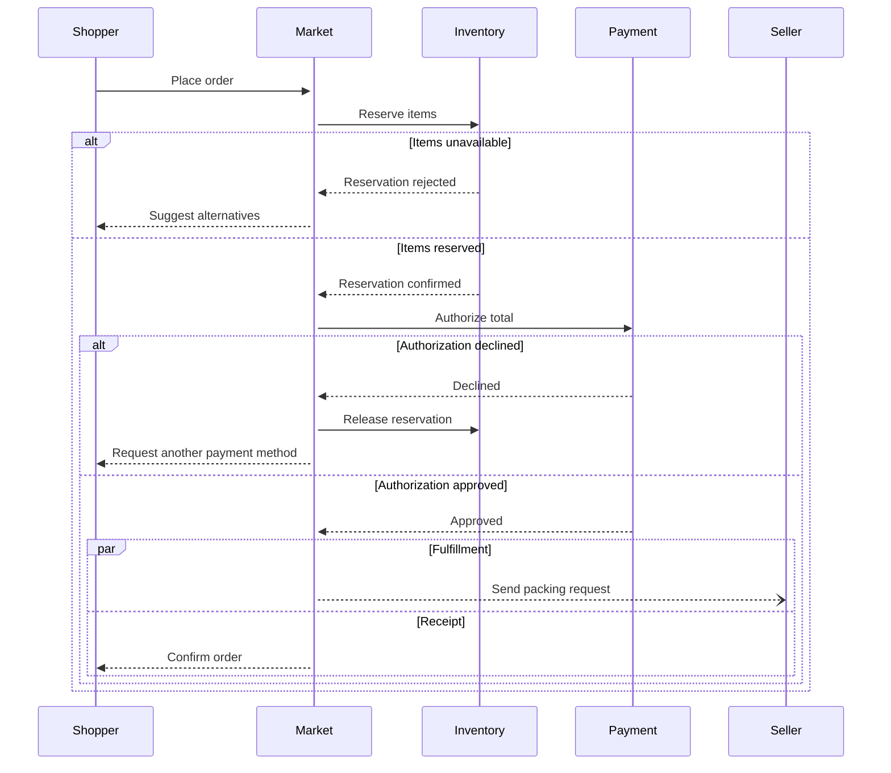
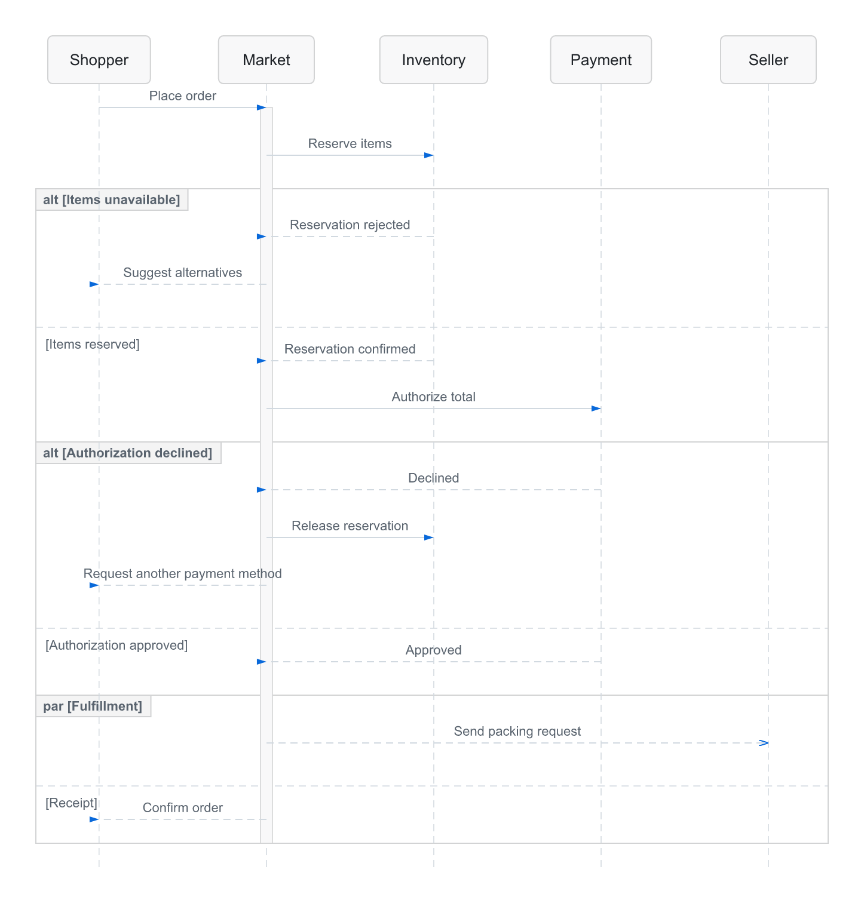

# Marketplace order sequence

Exercise nested alternatives plus parallel fulfillment and receipt work.

**Capability:** render-only specialized family.



## Rendered output



Generated with:

```bash
beautiflow render examples/sources/16-marketplace-order-sequence.mmd --format png --theme github-light --transparent --output examples/rendered/16-marketplace-order-sequence.png
```

## Try it

Keep the live result open:

```bash
beautiflow server examples/sources/16-marketplace-order-sequence.mmd
```

Run Beautiflow directly:

```bash
beautiflow render examples/sources/16-marketplace-order-sequence.mmd --format svg
```

Or ask an agent with the Beautiflow skill:

```text
Render the order sequence and identify the two recovery paths.
Use examples/sources/16-marketplace-order-sequence.mmd and show me the result.
```
