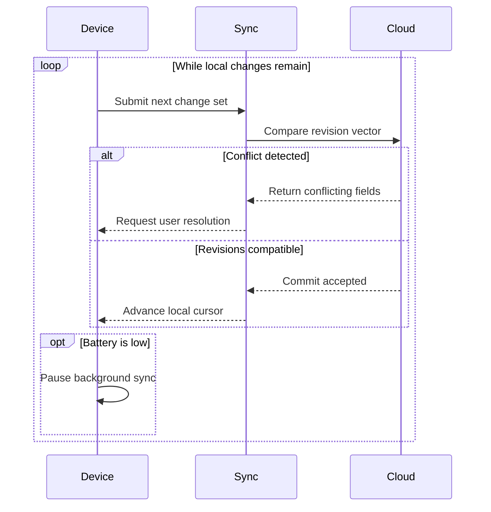
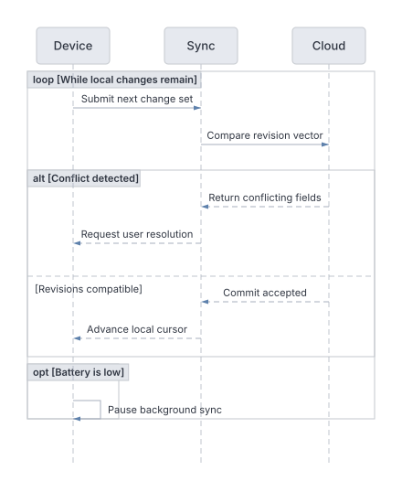

# Device sync sequence

Explore a loop with conflict handling and an optional battery pause.

**Capability:** render-only specialized family.



## Rendered output



Generated with:

```bash
beautiflow render examples/sources/17-device-sync-sequence.mmd --format svg --theme nord-light --transparent --output examples/rendered/17-device-sync-sequence.svg
```

## Try it

Keep the live result open:

```bash
beautiflow server examples/sources/17-device-sync-sequence.mmd
```

Run Beautiflow directly:

```bash
beautiflow render examples/sources/17-device-sync-sequence.mmd --format svg
```

Or ask an agent with the Beautiflow skill:

```text
Render the sync protocol and explain the conflict branch.
Use examples/sources/17-device-sync-sequence.mmd and show me the result.
```
