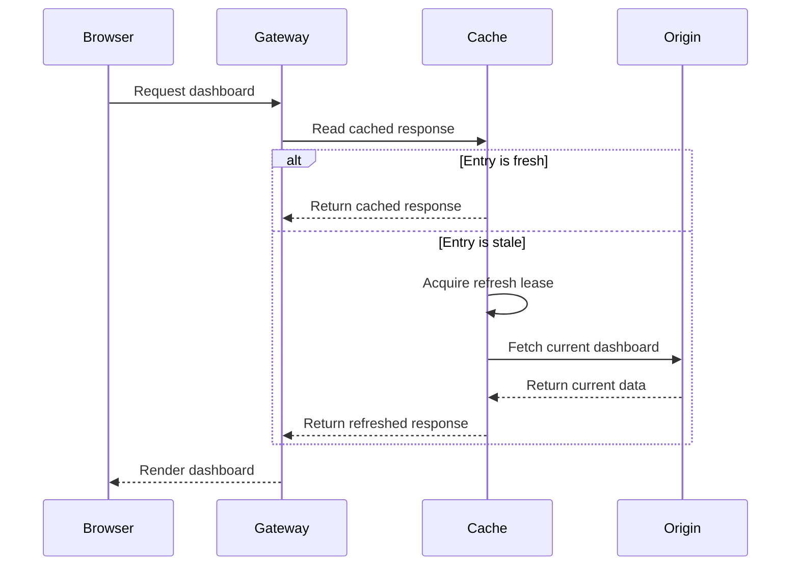
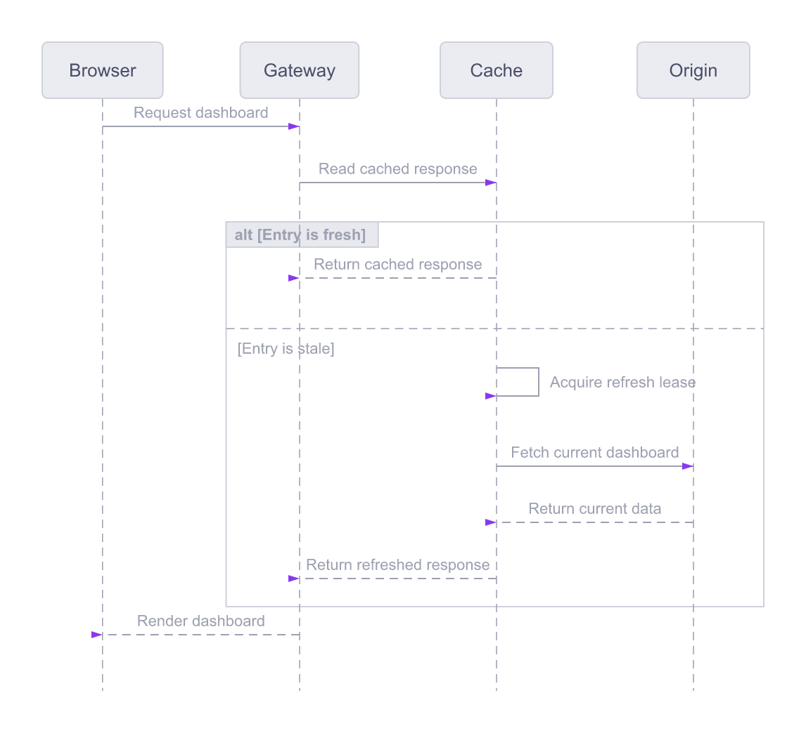

# Cache refresh sequence

Show a self-message and fresh-versus-stale cache behavior.

**Capability:** render-only specialized family.



## Rendered output



Generated with:

```bash
beautiflow render examples/sources/18-cache-refresh-sequence.mmd --format png --theme catppuccin-latte --transparent --output examples/rendered/18-cache-refresh-sequence.png
```

## Try it

Keep the live result open:

```bash
beautiflow server examples/sources/18-cache-refresh-sequence.mmd
```

Run Beautiflow directly:

```bash
beautiflow render examples/sources/18-cache-refresh-sequence.mmd --format svg
```

Or ask an agent with the Beautiflow skill:

```text
Render the cache exchange and make sure the refresh lease is visible.
Use examples/sources/18-cache-refresh-sequence.mmd and show me the result.
```
