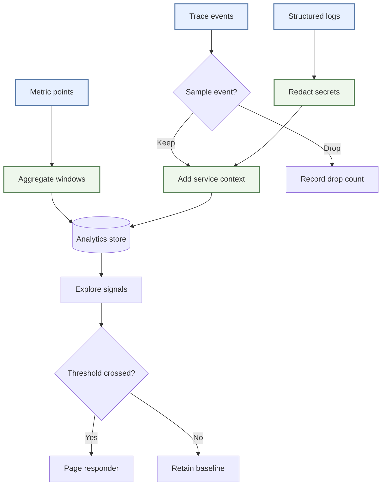
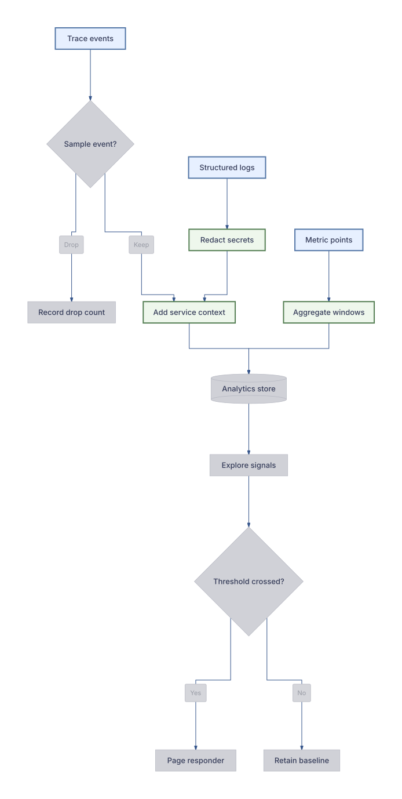

# Observability routing

Work with multiple sources, custom classes, aggregation, and alerting.

**Capability:** full flowchart/state pipeline.



## Rendered output



Generated with:

```bash
beautiflow render examples/sources/19-observability-routing.mmd --format svg --theme tokyo-night-light --transparent --output examples/rendered/19-observability-routing.svg
```

## Try it

Keep the live result open:

```bash
beautiflow server examples/sources/19-observability-routing.mmd
```

Run Beautiflow directly:

```bash
beautiflow polish examples/sources/19-observability-routing.mmd
```

Or ask an agent with the Beautiflow skill:

```text
Polish the observability flow while retaining its source and action styling.
Use examples/sources/19-observability-routing.mmd and show me the result.
```
