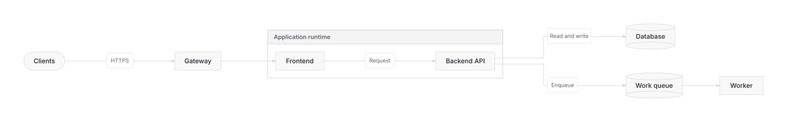
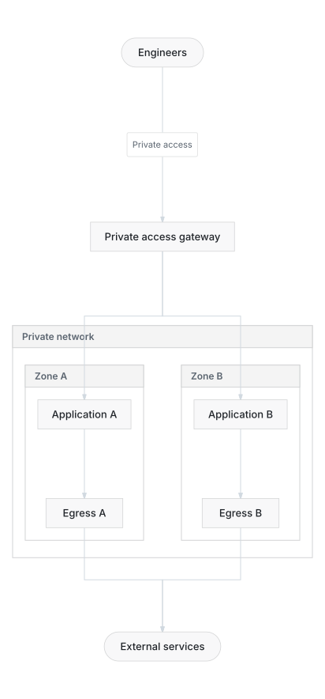
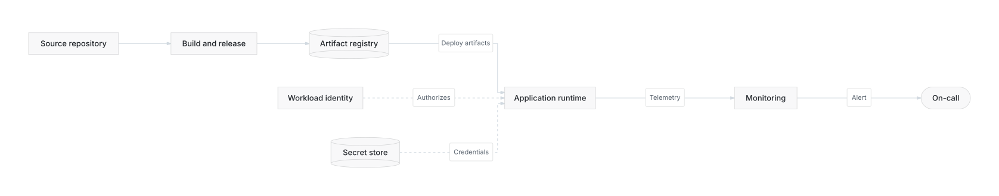

# Architecture views, without cloud-specific layout rules

Start with the question, then choose a view. These are illustrative logical architectures, not deployable infrastructure. They work with AWS, GCP, Azure, on-premises, and mixed environments; the harness maps abstract responsibilities to the actual services and verifies provider semantics.

The complete [AWS reference](../aws-architecture/rendered/step-6-production-architecture.svg) remains available. These views are separate examples, not automatic projections of that reference, and intentionally do not claim identical topology.

## Request flow



Use this view to explain a request through an application and its data dependencies. Supporting deployment and network detail belongs elsewhere.

```bash
beautiflow render examples/recipes/architecture-views/request.mmd --format svg --theme github-light --output examples/recipes/architecture-views/rendered/request.svg
```

## Network and availability



Two independently routed zones communicate availability intent. The egress components are logical responsibilities: different clouds may implement them with zonal or regional services. Do not infer a chain between redundant components.

```bash
beautiflow render examples/recipes/architecture-views/network.mmd --format svg --theme github-light --output examples/recipes/architecture-views/rendered/network.svg
```

## Delivery and operations



Solid arrows show artifact delivery or telemetry, as labelled; dotted arrows show identity and credential dependencies. These are not user-request paths. A longest-path algorithm cannot determine those meanings.

```bash
beautiflow render examples/recipes/architecture-views/operations.mmd --format svg --theme github-light --output examples/recipes/architecture-views/rendered/operations.svg
```

## Choosing notation

These focused views use ordinary Mermaid flowcharts because labelled relationships matter more than service icons. Use `architecture-beta` when ports, icons, and containment are the main subject. Beautiflow retains Mermaid's native renderer for small architecture diagrams; large supported multilevel diagrams use measured, provider-neutral compound layout.

For another provider, author a new source with its actual services, boundaries, and relationships. Changing icons alone does not validate an architecture. Never delete detail from a complete source just to improve its score.

Preview any source with `beautiflow server <file.mmd>`. In the website gallery, open the full-size SVG to inspect text at its intended size.
