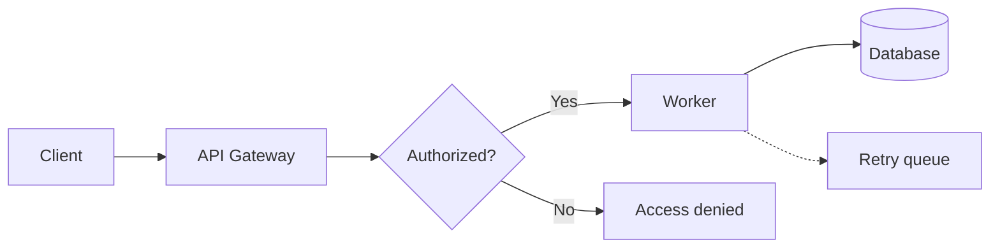

# Architecture action recipe

This recipe demonstrates the difference between presentation actions and semantic transformations using one small architecture flow.



## Preview the input

```bash
beautiflow server examples/recipes/architecture/architecture.mmd
```

## Apply presentation actions

[`layout-actions.json`](layout-actions.json) marks the primary flow, assigns the denied node an exception role, and places the retry queue relative to the database. It changes sidecar presentation state rather than Mermaid topology.

Inspect the result without writing:

```bash
beautiflow apply examples/recipes/architecture/architecture.mmd \
  --actions examples/recipes/architecture/layout-actions.json \
  --dry-run --json
```

Apply it:

```bash
beautiflow apply examples/recipes/architecture/architecture.mmd \
  --actions examples/recipes/architecture/layout-actions.json \
  --json
```

## Transform graph semantics

[`graph-transformations.json`](graph-transformations.json) inserts a validation decision, labels its valid edge, and adds an invalid path. It changes Mermaid source as well as reconciling layout state.

Always inspect a structural edit first:

```bash
beautiflow transform examples/recipes/architecture/architecture.mmd \
  --actions examples/recipes/architecture/graph-transformations.json \
  --dry-run --json
```

To experiment without modifying the committed fixture, copy the recipe:

```bash
cp -R examples/recipes/architecture /tmp/beautiflow-architecture
beautiflow transform /tmp/beautiflow-architecture/architecture.mmd \
  --actions /tmp/beautiflow-architecture/graph-transformations.json \
  --json
```

## Key distinction

| Command | Changes topology | Writes Mermaid | Writes sidecar |
| --- | --- | --- | --- |
| `apply` | No | No | Yes |
| `transform` | Yes | Yes | Yes |
| Either with `--dry-run` | Evaluates only | No | No |
