# Build an AWS architecture diagram from scratch

This walkthrough shows one conversation growing from a four-line brief into a production-oriented AWS architecture. Every step includes the exact user prompt, the Mermaid snapshot produced by the agent, the Beautiflow command used to render it, and the resulting SVG.

The diagram is an explanatory architecture artifact, not deployable infrastructure or a substitute for an AWS Well-Architected and security review.

## Before you start

Open the first snapshot in the live viewer:

```bash
beautiflow server examples/recipes/aws-architecture/sources/step-1-system-boundary.mmd
```

In another terminal, start Pi, Claude Code, or Codex with the Beautiflow skill installed. In a real conversation the agent would keep editing one working `.mmd` file. This recipe retains a separate snapshot after each turn so you can compare the progression.

## AWS architecture rendering

This recipe uses Mermaid `architecture-beta`, not a generic flowchart. Mermaid supplies parsing, labels, boundaries, registered `logos`, `lucide`, and `aws` icons, and the native layout used by the smaller snapshots. The full production snapshot crosses Beautiflow’s complexity threshold and uses the compound ELK stability fallback instead of accepting an extreme fCoSE arrangement. The result works as SVG, PNG, and live server output. The layout and audit code are provider-neutral; AWS-specific decisions live only in these example sources.

AWS service glyphs come from the CC0 SVG Logos collection where available. Lucide supplies neutral actors and fallbacks for services absent from that collection. They create an AWS-documentation-style diagram but are not a redistributed copy of the official AWS Architecture Icon Package. AWS names and marks remain the property of Amazon Web Services.

## Presentation layout

Every snapshot is authored with explicit `L/R/T/B` ports. Normal snapshots retain Mermaid’s documented straight and single-elbow connectors. For the large multilevel final snapshot, the stability fallback sizes groups from measured icons and labels. Open the complete reference at full size rather than shrinking all services onto a small slide. SVG is recommended for PowerPoint because it stays sharp when resized.

### Standard-symbol variant

The [generic source](variants/step-6-production-architecture-standard.mmd) keeps the complete Step 6 topology but replaces every Iconify and AWS service mark with Mermaid’s built-in `internet`, `server`, `database`, and `disk` architecture symbols.

```bash
beautiflow render examples/recipes/aws-architecture/variants/step-6-production-architecture-standard.mmd --format svg --theme github-light --output examples/recipes/aws-architecture/variants/step-6-production-architecture-standard.svg
```

Live preview:

```bash
beautiflow server examples/recipes/aws-architecture/variants/step-6-production-architecture-standard.mmd
```

[View the standard-symbol SVG](variants/step-6-production-architecture-standard.svg).

For a version that does not use `architecture-beta` at all, use the conventional Mermaid [`flowchart LR` source](variants/step-6-production-architecture-flowchart-reviewed.mmd):

```bash
beautiflow render examples/recipes/aws-architecture/variants/step-6-production-architecture-flowchart-reviewed.mmd --format svg --theme github-light --output examples/recipes/aws-architecture/variants/step-6-production-architecture-flowchart-reviewed.svg
```

```bash
beautiflow server examples/recipes/aws-architecture/variants/step-6-production-architecture-flowchart-reviewed.mmd
```

[View the conventional flowchart SVG](variants/step-6-production-architecture-flowchart-reviewed.svg).

---

## Step 1 — Establish the system boundary

### Input prompt

```text
Create a new architecture diagram from scratch.

The system will run in one AWS account. It needs a VPC, an Amazon EKS cluster, an Amazon Aurora PostgreSQL database, public internet access, and an AWS Site-to-Site VPN for remote engineers.

Start with a conceptual system boundary. Do not add implementation detail yet. Use stable, descriptive Mermaid IDs so we can extend it later with Beautiflow.
```

### What the agent adds

- Public users and remote engineers
- One AWS account and VPC boundary
- EKS as the application platform
- Aurora as the data tier
- Public and private access paths

[View the Mermaid source](sources/step-1-system-boundary.mmd).

### Output



```bash
beautiflow render examples/recipes/aws-architecture/sources/step-1-system-boundary.mmd --format svg --theme github-light --output examples/recipes/aws-architecture/rendered/step-1-system-boundary.svg
```

At this stage the direct internet-to-EKS line is intentionally conceptual. Later prompts replace it with the real edge path.

---

## Step 2 — Add a resilient network foundation

### Input prompt

```text
Expand the architecture into a two-Availability-Zone VPC.

Add public, private application, and isolated data subnets in both zones. Show the Internet Gateway, Customer Gateway, Site-to-Site VPN, and Virtual Private Gateway. Public traffic should enter through public subnets; VPN traffic should reach only private application subnets.

Keep this step focused on network placement. Do not add Kubernetes workloads yet.
```

### What changes

- The VPC receives an illustrative `10.0.0.0/16` address range
- Availability Zones A and B become explicit
- Public, application, and data subnet classes are separated
- Internet and corporate paths terminate at different gateways

[View the Mermaid source](sources/step-2-network-foundation.mmd).

### Output



```bash
beautiflow render examples/recipes/aws-architecture/sources/step-2-network-foundation.mmd --format svg --theme github-light --output examples/recipes/aws-architecture/rendered/step-2-network-foundation.svg
```

---

## Step 3 — Place frontend and backend workloads in EKS

### Input prompt

```text
Add Amazon EKS in the private application subnets across both Availability Zones.

EKS must contain a frontend deployment and a backend deployment spanning AZ A and AZ B. Represent each deployment as one architecture service so the slide stays readable, while keeping both zones explicit in its label. Put the AWS Load Balancer Controller in the cluster. The public load balancer should reach only the frontend path. Frontend pods call the backend, and VPN users may reach the backend privately.
```

### What changes

- EKS spans private application subnets
- Frontend and backend each have two pods
- Frontend and backend deployment icons each state their two-zone placement
- The public route ends at the frontend
- The backend receives a distinct VPN administration path

[View the Mermaid source](sources/step-3-eks-workloads.mmd).

### Output



```bash
beautiflow render examples/recipes/aws-architecture/sources/step-3-eks-workloads.mmd --format svg --theme github-light --output examples/recipes/aws-architecture/rendered/step-3-eks-workloads.svg
```

---

## Step 4 — Add the Aurora data tier

### Input prompt

```text
Add the production database path.

Use Amazon Aurora PostgreSQL in isolated data subnets. Show an Aurora writer in AZ A and a reader in AZ B with replication. Put Amazon RDS Proxy between backend pods and Aurora. Backend pods are the only application workloads connected to RDS Proxy. Add AWS Secrets Manager for database credentials and show that credentials are delivered to the backend, not stored in the diagrammed application path.
```

### What changes

- Backend-to-database ownership becomes unambiguous
- RDS Proxy absorbs application connection churn
- Aurora writer and reader communicate Multi-AZ intent
- Credentials are separated from ordinary request flow

[View the Mermaid source](sources/step-4-data-layer.mmd).

### Output



```bash
beautiflow render examples/recipes/aws-architecture/sources/step-4-data-layer.mmd --format svg --theme github-light --output examples/recipes/aws-architecture/rendered/step-4-data-layer.svg
```

---

## Step 5 — Complete ingress, VPN, and controlled egress

### Input prompt

```text
Replace the conceptual public connection with a realistic edge path.

Public users should resolve Amazon Route 53, pass through Amazon CloudFront and AWS WAF, then reach an Application Load Balancer in the public subnets. The ALB sends application traffic to the frontend service. Show the controller configuring the ALB as a separate management relationship. Keep Site-to-Site VPN access separate through a Virtual Private Gateway. Add one NAT Gateway per Availability Zone for controlled backend egress. Preserve the frontend-to-backend and backend-to-Aurora paths.
```

### What changes

- Public ingress becomes `Route 53 → CloudFront → WAF → ALB`
- The ALB routes to frontend workloads; the controller configures the ALB separately
- Corporate access remains private and separate
- NAT gateways provide zonal egress without exposing pods publicly

[View the Mermaid source](sources/step-5-edge-and-access.mmd).

### Output



```bash
beautiflow render examples/recipes/aws-architecture/sources/step-5-edge-and-access.mmd --format svg --theme github-light --output examples/recipes/aws-architecture/rendered/step-5-edge-and-access.svg
```

---

## Step 6 — Finish the production architecture

### Input prompt

```text
Turn this into a complete production architecture diagram while keeping it readable.

Preserve the two-AZ network, public edge, VPN, EKS frontend/backend workloads, RDS Proxy, and Aurora writer/reader. Add:

- a source repository and CI/CD pipeline
- Amazon ECR with signed container images delivered to EKS
- AWS IAM with IRSA for workload identity
- AWS Secrets Manager for backend database credentials
- Amazon CloudWatch logs, metrics, alarms, and an operations on-call destination
- automated Aurora snapshots archived to Amazon S3
- an Internet Gateway and one NAT Gateway per Availability Zone

Use explicit architecture ports for every connection. Keep AWS account, VPC, subnet, EKS, and database boundaries visible. Arrange delivery, public ingress, runtime, VPN, and operations as horizontal rows suitable for a widescreen presentation. Show supporting identity, secret, image, telemetry, and backup relationships without connecting frontend pods directly to Aurora.
```

### What changes

- Delivery, identity, secrets, telemetry, alerting, and backups appear as supporting planes
- Runtime and operational relationships are retained without inventing a primary flow from the longest path
- Every public, private, and data boundary remains explicit
- The final diagram explains both request flow and production operations

[View the complete Mermaid source](sources/step-6-production-architecture.mmd).

### Final output



```bash
beautiflow render examples/recipes/aws-architecture/sources/step-6-production-architecture.mmd --format svg --theme github-light --output examples/recipes/aws-architecture/rendered/step-6-production-architecture.svg
```

Open the complete result as a live, zoomable SVG:

```bash
beautiflow server examples/recipes/aws-architecture/sources/step-6-production-architecture.mmd
```

## Final architecture inventory

| Concern | Final design |
| --- | --- |
| Account boundary | One AWS account |
| Network | One VPC across two Availability Zones |
| Public ingress | Route 53 → CloudFront → WAF → ALB |
| Private access | Corporate network → Customer Gateway → Site-to-Site VPN → Virtual Private Gateway |
| Compute | Private Amazon EKS cluster with frontend and backend deployments across both zones |
| Workload routing | ALB → frontend workloads → backend workloads; the controller configures the ALB |
| Database | Backend pods → RDS Proxy → Aurora PostgreSQL writer and reader in isolated subnets |
| Egress | One NAT Gateway per Availability Zone |
| Delivery | Source repository → CI/CD → Amazon ECR → EKS |
| Identity and secrets | IAM/IRSA and Secrets Manager scoped to backend workloads |
| Observability | EKS → CloudWatch → alarms → operations on-call |
| Recovery | Aurora automated snapshots → Amazon S3 archive |


## Reading the reviewed examples

The reviewed snapshots connect the ALB to frontend workloads, with a separate controller-to-ALB configuration relationship. NAT-A and NAT-B are independent egress dependencies, not a serial chain. The complete reference is still illustrative: DNS, filtering, backup, identity, and management relationships must not all be interpreted as packet forwarding.

The conventional flowchart's reviewed version shows the controller relationship with a labelled dotted edge. The original unreviewed flowchart file remains only as a historical artifact and is not the recommended example.

For presentation-sized explanations, start with the separate [request, network, and operations examples](../architecture-views/README.md). They use provider-neutral responsibilities, are not automatic projections of this AWS source, and do not replace the complete reference.

Solid arrows in the native architecture reference mean directed relationships, not necessarily request traffic. A layout algorithm cannot validate provider semantics; review those separately using [AWS load-balancing guidance](https://docs.aws.amazon.com/eks/latest/best-practices/load-balancing.html) and [zonal NAT guidance](https://docs.aws.amazon.com/vpc/latest/userguide/nat-gateway-basics.html).

## Continue the conversation

Useful next prompts include:

```text
Add an internal-only operations service reachable through the VPN. Keep it out of the public ALB path.
```

```text
Add ElastiCache between backend pods and Aurora, but make cache misses and database writes semantically clear.
```

```text
Split the backend into orders and billing services. Only billing may access payment credentials, and both services must keep private database paths.
```

```text
Use Beautiflow diagnose and audit on the final diagram. Fix only mechanical findings; do not remove production detail to improve the score.
```
