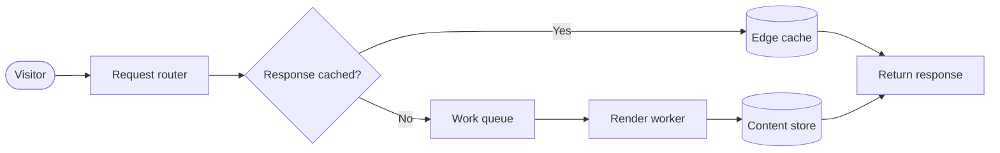
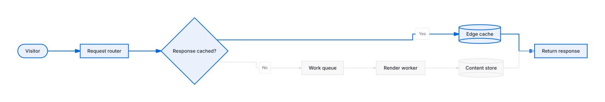
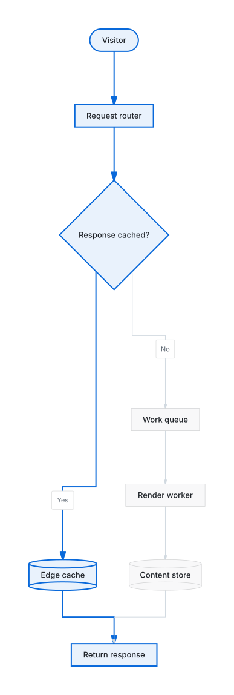
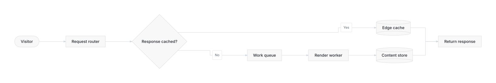
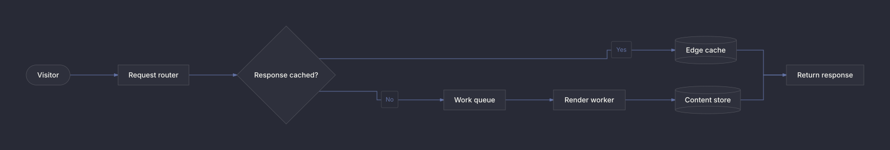
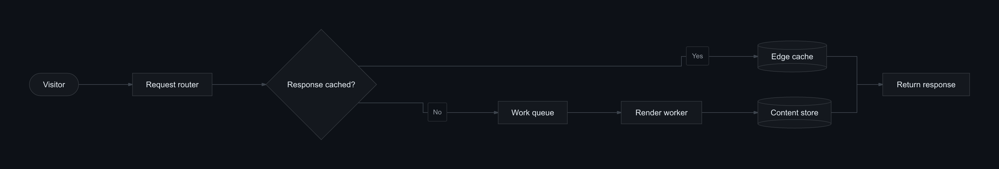
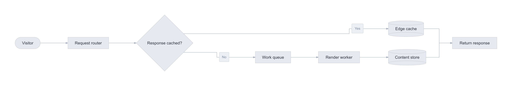

# One diagram, multiple render options

This recipe renders the same request flow in eight ways to demonstrate Beautiflow’s layout direction, formats, themes, and transparent backgrounds.



## Layout direction

The Mermaid semantics stay identical while sidecar actions generate horizontal and vertical layouts. Both renders use the same theme so only geometry and semantic emphasis change.

| Left to right | Top to bottom |
| --- | --- |
|  |  |

Left to right:

```bash
beautiflow apply examples/recipes/render-options/diagram.mmd --actions examples/recipes/render-options/layout-left-to-right.json --json
beautiflow render examples/recipes/render-options/diagram.mmd --format svg --theme github-light --output examples/recipes/render-options/rendered/layout-left-to-right.svg
```

Top to bottom:

```bash
beautiflow apply examples/recipes/render-options/diagram.mmd --actions examples/recipes/render-options/layout-top-to-bottom.json --json
beautiflow render examples/recipes/render-options/diagram.mmd --format svg --theme github-light --output examples/recipes/render-options/rendered/layout-top-to-bottom.svg
```

Both action files also preserve the cached response as the primary flow and mark the render-worker path as secondary. Remove generated local state after reproducing the comparison:

```bash
rm -f examples/recipes/render-options/diagram.beautiflow.json
```

## SVG themes

| GitHub Light | Dracula |
| --- | --- |
|  |  |

```bash
beautiflow render examples/recipes/render-options/diagram.mmd --format svg --theme github-light --output examples/recipes/render-options/rendered/github-light.svg
beautiflow render examples/recipes/render-options/diagram.mmd --format svg --theme dracula --output examples/recipes/render-options/rendered/dracula.svg
```

SVG remains scalable and is the best choice for documentation and the web.

## PNG backgrounds

| GitHub Dark | Transparent Nord Light |
| --- | --- |
|  |  |

```bash
beautiflow render examples/recipes/render-options/diagram.mmd --format png --theme github-dark --output examples/recipes/render-options/rendered/github-dark.png
beautiflow render examples/recipes/render-options/diagram.mmd --format png --theme nord-light --transparent --output examples/recipes/render-options/rendered/nord-light-transparent.png
```

PNG is convenient for slides and chat. `--transparent` removes the canvas background while retaining diagram colors.

## Terminal output

Unicode:

```text
┌─────────┐     ┌────────────────┐
│ Visitor │ ──▶ │ Request router │ ──▶ …
└─────────┘     └────────────────┘
```

```bash
beautiflow render examples/recipes/render-options/diagram.mmd --format unicode --output examples/recipes/render-options/rendered/diagram-unicode.txt
```

ASCII:

```text
+---------+     +----------------+
| Visitor | --> | Request router | --> ...
+---------+     +----------------+
```

```bash
beautiflow render examples/recipes/render-options/diagram.mmd --format ascii --output examples/recipes/render-options/rendered/diagram-ascii.txt
```

The complete generated terminal output is available in [`diagram-unicode.txt`](rendered/diagram-unicode.txt) and [`diagram-ascii.txt`](rendered/diagram-ascii.txt).

## Live preview

```bash
beautiflow server examples/recipes/render-options/diagram.mmd
```

Server mode renders the saved diagram using its sidecar state and updates after every save.
