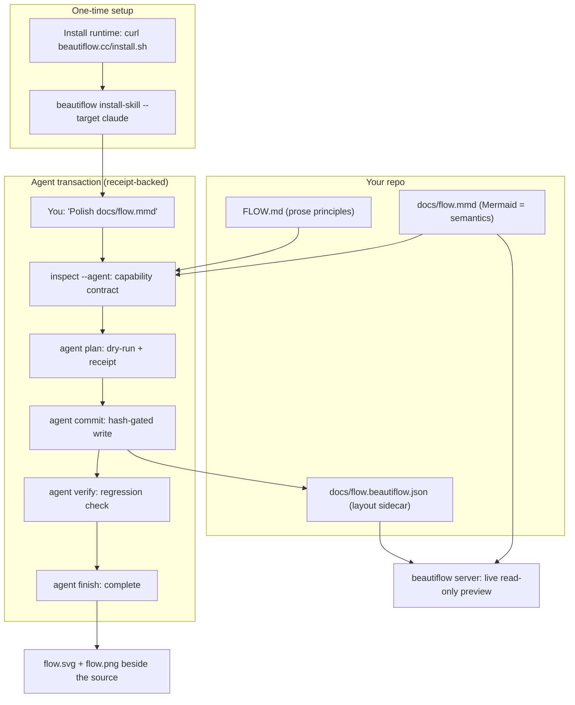

# Fix: polish can permanently regress a diagram below its own no-sidecar baseline

## Why

### Summary

On a diagram that has no sidecar yet, `beautiflow polish` can select and persist
a layout that audits **16 points below** what the exact same diagram scores with
no sidecar at all — introducing edge crossings that the pristine ELK layout does
not have. The regression then:

1. passes the full receipt-backed agent runtime (`plan → commit → verify`) with
   `ok: true` and **zero warnings**,
2. is persisted in a committable artifact (`*.beautiflow.json`), and
3. becomes **unrecoverable through polish**: every later run reports `unchanged`
   because candidates are always evaluated through the same lossy round-trip and
   the sidecar-free baseline is never considered again.

This contradicts the product's own stated invariants — README: *"Reject stale
plans, repeated corrections, unsupported operations, and quality regressions"*;
PRODUCT.md: *"failed validation always stops mutation"* — on the single
most-travelled mutation path: `polish` is the advertised one-command human path
and the agent skill's default routine operation.

Two independent defects compound to produce this:

- **Defect A (root cause):** the sidecar round-trip is not idempotent. Writing a
  candidate's positions to the sidecar and re-running layout silently demotes
  every edge from its high-quality ELK route to the Manhattan fallback router,
  even when no node actually moved.
- **Defect B (missing gate):** on first run, `polish` accepts any candidate that
  merely has no overlaps and no edge-through-node intersections, without ever
  comparing its score against the sidecar-free baseline it is replacing.

This proposal was found and reproduced during a real agent session: a Claude
Code agent following the embedded skill exactly as written would have committed
the regression; only manual reading of the receipt's `evidence` block prevented
it.

### Deterministic reproduction

All numbers below are from `beautiflow 0.8.0` (standalone binary, macOS arm64)
and reproduce identically on every run. Reproduction diagram
(13 nodes, 13 edges, 3 subgraphs — `adoption-flow.mmd`):



**Step 1 — baseline, no sidecar.** `beautiflow audit adoption-flow.mmd --json`:

```
score 97 · nodeOverlaps 0 · edgeCrossings 0 · edgeNodeIntersections 0
totalBends 16 · alignmentScore 0.179 · aspectRatio 1.062 · issues []
```

**Step 2 — polish dry run.** `beautiflow polish adoption-flow.mmd --dry-run --json`:

```
status  dry-run-initialized
selected candidate-4
before  score 97 · crossings 0 · bends 16
after   score 81 · crossings 2 · bends 24
```

Note `alignmentScore` and `aspectRatio` are **identical** before and after
(0.179 / 1.062): node geometry did not change at all. The entire 16-point drop
is edge routing.

**Step 3 — the round-trip alone loses 16 points.**
`beautiflow layout adoption-flow.mmd --candidates 5 --json` reports each
candidate's own audit next to the final score after saving the winner to the
sidecar and re-applying layout:

```
candidate-4  own audit 97  (TD, spacing 48/88,  crossings 0, bends 16)   <- selected
candidate-5  own audit 97  (TD, spacing 72/112, crossings 0, bends 16)
candidate-1  own audit 78  (LR, spacing 40/80)
candidate-2  own audit 78  (LR, spacing 64/104)
candidate-3  own audit 78  (LR, spacing 88/128)

final score after sidecar round-trip of candidate-4: 81
```

The same candidate, the same coordinates: 97 as a fresh layout, 81 after being
persisted and re-applied. Nothing about the diagram changed in between.

**Step 4 — every downstream gate approves it.** Full agent transaction on a
fresh copy:

```
agent plan   --operation polish   -> state validated   (evidence: before 97 -> after 81)
agent commit                      -> state applied,  ok: true, score 81
agent verify                      -> state verified, ok: true, warnings: []
audit (persisted result)          -> score 81, edgeCrossings 2
```

**Step 5 — the diagram is now trapped.** `beautiflow polish --dry-run` on the
committed result:

```
status dry-run-unchanged · before 81 -> after 81
```

The 97-score layout still exists — it is what any user gets by deleting the
sidecar — but polish can never return to it.

**Secondary evidence — the route degradation is general, not topology luck.**
A different 13-node/13-edge diagram with 3 subgraphs (`order-flow.mmd`, included
in the task list as a second fixture) survives the round-trip with its score
intact but its bends grow from 18 to 26; the score is unchanged only because the
bend penalty in `auditDiagram` starts at `totalBends > 2 × edges` (26 > 26 is
false). The routes still got strictly worse; the score threshold masked it.

### Root cause analysis

**Defect A — the sidecar round-trip demotes ELK routes (`src/diagram/layout.ts`).**

`layoutProject` preserves an edge's ELK route only when both endpoints are
classified "unmoved" (`src/diagram/layout.ts:253-265`):

```ts
const sourceUnmoved = originalNodeSource
  && Math.abs(source.x - (originalNodeSource.x + canvas.shiftX)) < 0.01
  && Math.abs(source.y - (originalNodeSource.y + canvas.shiftY)) < 0.01
...
const points = useElkRoute
  ? originalEdge.points.map((point) => ({ x: point.x + canvas.shiftX, ... }))
  : routeEdge(source, target, options.direction, nodes)
```

Here `source.x` is the sidecar override, `originalNodeSource.x` is a freshly
computed raw ELK position, and `canvas.shiftX` is the `normalizeCanvas` shift of
the **overridden** node set. The three quantities live in different frames:

1. **Spacing frame.** Candidate positions are produced at preset spacings
   (`CANDIDATE_PRESETS`, `src/diagram/layout.ts:294-300`), but the re-apply pass
   always recomputes ELK at the defaults (`nodeSpacing ?? 48`,
   `layerSpacing ?? 88`, `src/diagram/layout.ts:214-219`) because
   `polishProject` re-applies with only `{ direction, applyOverrides: true }`
   (`src/diagram/polish.ts:43`). For four of the five presets (1, 2, 3, 5) the
   stored coordinates therefore **cannot** match the fresh ELK coordinates:
   round-trip demotion is structurally guaranteed whenever those candidates win.
2. **Normalization frame.** Even for candidate-4 (whose spacing equals the
   defaults), stored positions are post-`normalizeCanvas` — shifted so the node
   minimum sits at `PADDING` (48). During re-apply, the overridden set is
   already normalized, so its shift is ~0, and the check effectively compares
   `rawElk + candidateShift` against `rawElk + 0`. It passes only when the
   candidate run's shift happened to be zero, i.e. when the raw ELK node minimum
   was already exactly at the padding. With subgraphs, group headers offset the
   node minimum, the shift is non-zero, and **every node classifies as moved**.
   That is what happens in the reproduction: identical node geometry
   (alignment/aspect unchanged), yet all 13 edges fall back to
   `routeEdge` — the visibility-grid Manhattan router intended for manually
   moved nodes — which produces 2 crossings and 8 extra bends that ELK's routes
   do not have.

**Defect B — the first-run acceptance gate ignores the baseline
(`src/diagram/polish.ts:54-57`).**

```ts
const initialized = Object.keys(originalSidecar.nodes).length === 0
const valid = best.audit.metrics.nodeOverlaps === 0 && best.audit.metrics.edgeNodeIntersections === 0
const improved = valid && best.audit.score > before.score
const accepted = initialized ? valid : improved
```

For an established sidecar, acceptance correctly requires strict improvement.
On first use (`initialized`), *any* valid candidate is accepted — the baseline
score just computed into `before` is available two lines up and never consulted.
`docs/quality.md` documents this as *"On first use it initializes the best valid
sidecar"* — so the documented contract itself contains the hole; this proposal
strengthens the contract rather than merely fixing an implementation slip.

### Why no existing guardrail catches it

- **`polish` itself** — Defect B: the baseline comparison is skipped exactly on
  the initialization path.
- **`agent verify`** (`src/agent-runtime.ts:263-268`) compares the final audit
  against `receipt.expected` — which `agent plan` recorded **from the already
  degraded dry-run** (81). The final audit equals the degraded plan, so verify
  reports no regression. The regression happened between the baseline and the
  plan, a window verify never sees.
- **`inspect --agent`** exposes semantic diagnostics only; the capability
  contract contains no geometric score an agent could compare against before
  choosing `polish`.
- **The embedded skill** instructs agents to stop when "quality metrics do not
  regress" — but every machine signal the agent receives says exactly that.
  The receipt evidence *does* contain `before: 97, after: 81`, yet no state
  transition or warning is derived from it, and the skill does not (and should
  not need to) tell agents to re-derive regression checks the runtime claims to
  own.

### Blast radius

- `polish` is the top recommended operation in the agent capability contract
  for every flowchart/state diagram and the first command in README's direct
  usage section — this is the most common mutation any user or agent performs.
- The degraded sidecar is documented as committable project state
  (`docs/sidecar.md`), so the regression propagates through version control.
- The failure is self-concealing: subsequent polishes report `unchanged`, and
  nothing ever surfaces that a strictly better layout is one `rm` away.
- Diagrams without subgraphs and won by candidate-4 round-trip cleanly, which
  is why the bug can hide in simple smoke tests; any subgraph-bearing diagram
  (most real-world architecture/process flows) is exposed.

## What Changes

- **Phase 1 — acceptance gate (behavioral fix, small).**
  - On first run, `polish` SHALL treat the sidecar-free baseline as the
    incumbent: the best valid candidate is persisted only when its
    round-tripped audit score is **greater than or equal to** the baseline
    score. Otherwise polish keeps the baseline (no node overrides persisted),
    reports `status: unchanged`, `selected: current`, and `after == before`.
  - The polish JSON report (CLI and receipt evidence) SHALL be monotonic:
    `after.score >= before.score` in every outcome, dry-run and write modes.
  - `agent plan --operation polish` SHALL record the baseline score in the
    receipt, and `agent verify` SHALL flag a regression when the final audit
    falls below the recorded baseline — not only below the plan's expected
    score (defense in depth; closes the plan-window blind spot for all
    operations that carry a baseline).
- **Phase 2 — round-trip stability (root-cause fix).**
  - Fix the frame mismatch: classify a node "unmoved" by comparing its override
    against the freshly computed ELK position **after applying the fresh
    layout's own normalization shift**, so both sides live in the same
    normalized frame. This alone makes candidate-4-style round-trips lossless.
  - Persist the winning candidate's spacing (`nodeSpacing`, `layerSpacing`) as
    optional sidecar fields, and use them in the re-apply pass, so all five
    presets round-trip losslessly. Sidecar stays `version: 1`; the parser
    already ignores unknown fields, so the addition is forward- and
    backward-compatible.
  - Acceptance criterion: `polish` immediately after `polish` is a fixed point
    (identical geometry, `unchanged`), and `layout`'s final score equals the
    selected candidate's own audit score.
- **No breaking changes.** No new public flags, no change to the `status` enum
  (`initialized` | `improved` | `unchanged`), no sidecar version bump, no
  change to the receipt protocol version (additive evidence field only).
- **Docs sync (AGENTS.md rule 10).** `docs/quality.md` polish contract wording
  updated; CHANGELOG entry; committed example artifacts regenerated only if
  their geometry changes (per `CONTRIBUTING.md`).

## Impact

- **Affected specs:** `diagram-polish` (new capability spec — this change
  introduces the OpenSpec baseline for it; see `specs/diagram-polish/spec.md`).
- **Affected code:**
  - `src/diagram/polish.ts` — Phase 1 acceptance gate (`accepted`, status/
    selection reporting).
  - `src/agent-runtime.ts` — baseline recorded at plan time; verify regression
    list extended.
  - `src/diagram/layout.ts` — Phase 2 unmoved-classification frame fix; honor
    persisted spacing in `layoutProject`.
  - `src/diagram/project.ts` / `src/diagram/model.ts` — Phase 2 optional
    sidecar fields (parse + type).
  - `src/cli.ts` — no surface change expected; `runPolish` output already
    carries `before`/`after`.
- **Affected tests:** `test/polish.test.ts` (baseline-kept scenario, fixed-point
  scenario), `test/diagram.test.ts` (round-trip route preservation),
  `test/agent-runtime.test.ts` (baseline regression flagged by verify).
- **Affected docs:** `docs/quality.md`, `CHANGELOG.md`; `docs/sidecar.md` if
  Phase 2 fields land.
- **Migration:** none required. Existing sidecars remain valid. Sidecars
  created by 0.8.0 initialization that embed a degraded layout will start
  reporting honestly (their audit already reflects the degradation); an
  optional "baseline reclaim" for fully unpinned sidecars is listed as an open
  question in `design.md` rather than assumed.
